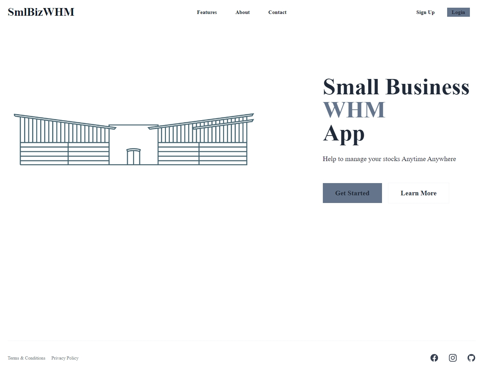

# bookSearchEngine

## Description

A lightweight WMS, have functions to customize packags, products and warehouses.

## Table of Contents

- [Installation](#installation)
- [Usage](#usage)
- [License](#license)
- [Contribution](#contribution)
- [Test](#test)
- [Further Questions](#furtherquestions)
- [Under Constructions](#underconstructions)

## Installation

for local installtion:

Open the directory from VS Code.

1. run `$npm install` to install packages.

2. run `$npm run develop` to start the app

3. the app should pop from the default browser automatically, otherwise use [localhost:](http://localhost:3000) to start

for online user:
1. simply open this link to use:
https://smallbusinesswms.onrender.com/

## Usage

1. open the link to see a landing page that you can get all the info you need about this page(links setup, content need to be filled),
pages are responsive.

  
  
  

2. you can either signup or signin for your personal data view

  
  

3. after login, you are on the main app page. You can view, add, modify the data about warehouse, package information, category and products.

  
  
  
  
  
  
  

4. other functions including auto calculated numbers, showing product photos.

  
  

## License

N/A

## Contribution
You can contribute to this application by revising the codes here:  
https://github.com/mkdkck/bookSearchEngine

## Test
N/A

## FurtherQuestions

please review the codes here：  
https://github.com/mkdkck/bookSearchEngine

or contact the owner via: colin173@gmail.com

## UnderConstructions
Here are few functions are waiting to be developed:
1. personal profile page
2. upload pic function for personal image and product photo
3. organization & user control
4. report generation
5. product editing page
6. better constructed back end logic of the data

## Badges

